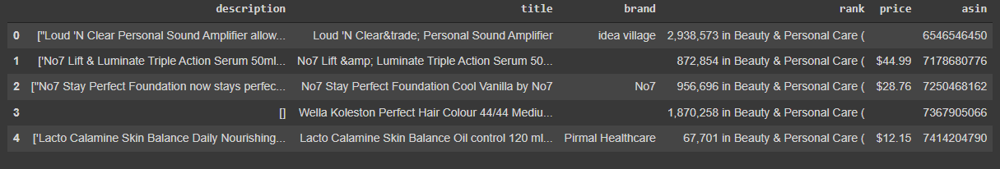
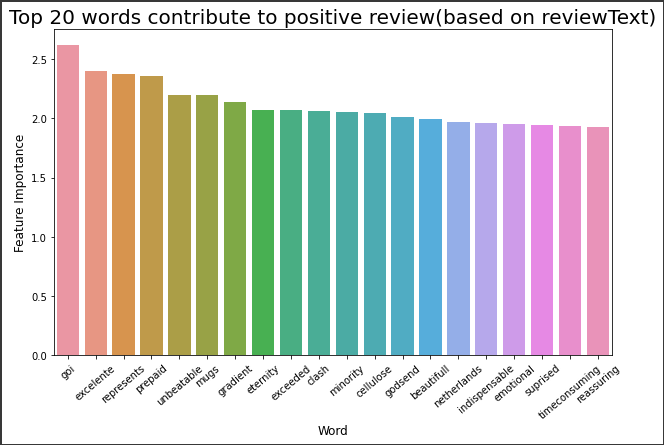
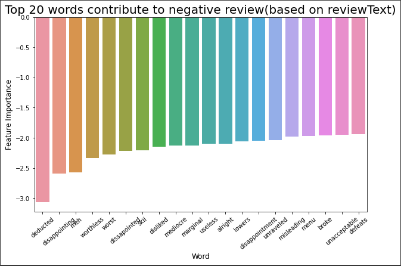

# Amazon-beauty-products-analysis
Using data science process to gain business insights from the Amazon beauty datasets and determine the factors that contribute to the high sales of a beauty product

Our anaylsis are focused on answering the following questions:
1. Does a high number of good ratings contribute to a lower sales rank and does a high number of bad ratings contribute to a higher sales rank ?
2. Which item has the lowest rating and which item has the highest rating ?
3. What are the common words found in the description of highly rated items?
4. What is the relationship between price and rating of an item?
5. What is the average price for items that have a high sales rank and what is the average price for items that have low sales rank ?
6. What is the peak time of the year for a customer to buy beauty products ?
7. How does an increase or decrease of price affect the sales rank of a beauty product?
8. What are the most common words contribute to negative reviews. Also, what are the most common words contribute to positive reviews?

For more info, please refer to the documentation pdf file in the reference folder

# How to start this program?
1. Download the dataset from google drive via this [link](https://drive.google.com/drive/folders/13AHln43Q6qEG8ENEGh1iUVm2gcagwoGY?usp=sharing) and put them into the dataset folder
2. Run the PartB_Code_A4.ipynb on your machine or colab

# Sample images of this program

